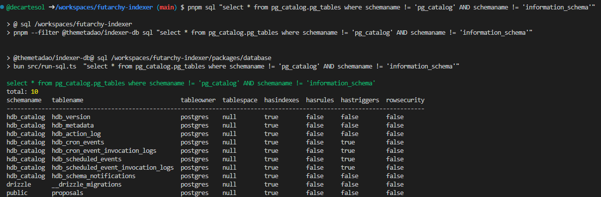

# Futarchy Indexer

This project aims to index order data from each of The Meta DAO's proposals into candlestick data. 
This way we can show charts on how the proposals do over time in the UI.

The indexer is made of 3 components:
- the indexer service which contacts an RPC periodically to poll for any orders on not yet concluded proposals; the indexer will consolidate the order data into candles then store these in a database
- a postgres database
- a hasura instance which exposes a real-time GraphQL read-only API over the postgres data

Since this is just a generic means to cache on-chain data into Postgres then expose a real-time GraphQL API over this data, it could be used for more than just candlestick indexing, but we'll begin with that use-case.

# Contributors

After cloning run `pnpm install` in the project directory

Docs on each top-level script below

## `migrate` script

Migrate db to match definition in `packages/database/lib/schema.ts`. Assumes you have set the `FUTARCHY_PG_URL` env var.  
Also regenerates the graphql client (TODO).

## `sql` script

Run raw sql against the database. Assumes you have set the `FUTARCHY_PG_URL` env var.

You can add to the `COMMON_STATEMENTS` const in `packages/database/src/run-sql.ts` if you have a long sql query you want to save for later reuse.

## `update-hasura` script

TODO

## `start-service` script

TODO

## `publish-client` script

TODO
